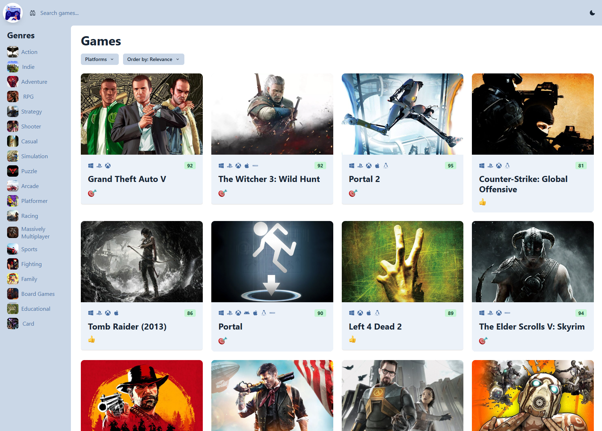
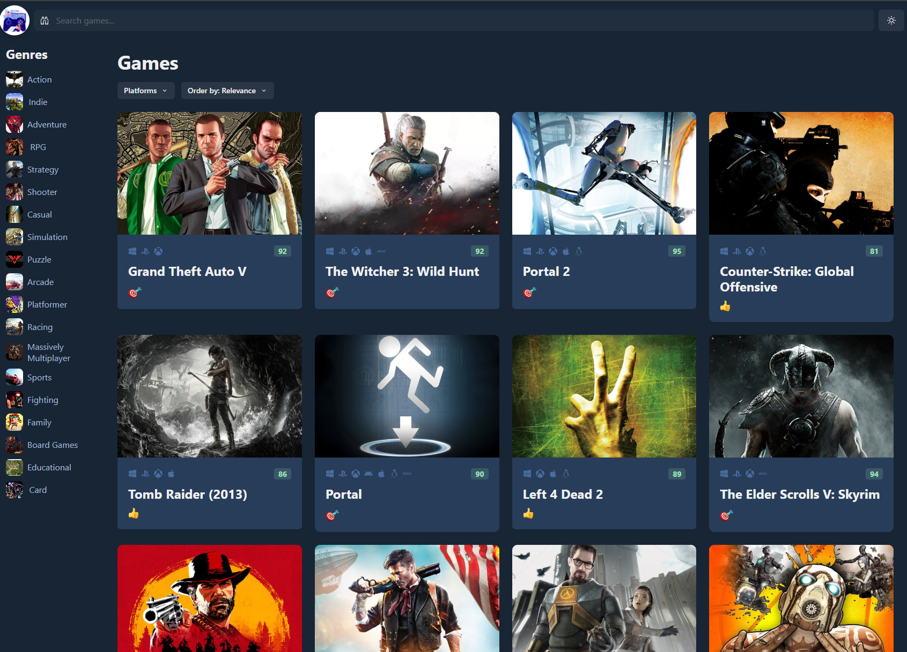
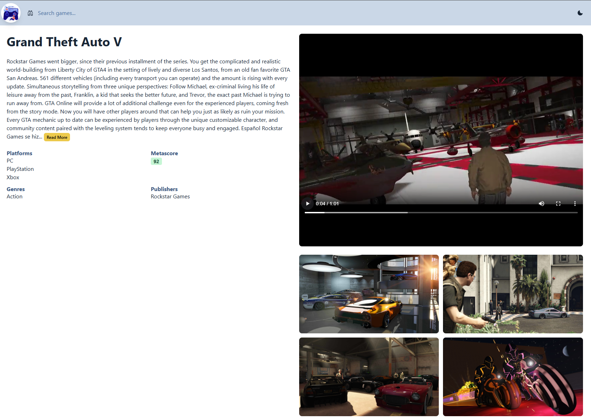
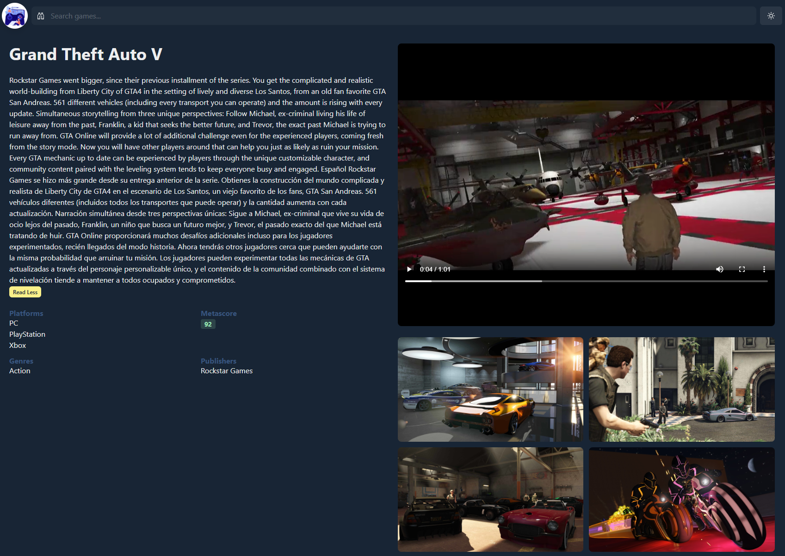

# Game Finder

> A modern game discovery platform built with React, TypeScript, and React Query.

**[Live Demo →](https://game-finder-by-dano.vercel.app/)**

**Home Page Light/Dark mode**  



**Game Details Light/Dark mode**  



## Features

- 🎮 Browse 850,000+ games from RAWG API
- 🔍 Search, filter, and sort games
- 📱 Fully responsive design
- ⚡ Infinite scroll with React Query caching
- 🌓 Dark/Light mode
- 🎬 View game trailers and screenshots

## Tech Stack

**Frontend:** React 18 • TypeScript • Chakra UI  
**State:** React Query (TanStack Query) • Zustand  
**API:** RAWG Video Games Database  
**Tools:** Vite • React Router • Vercel

## Getting Started

```bash
# Clone and install
git clone https://github.com/danielmiranda22/game-finder.git
cd game-finder
npm install

# Add your RAWG API key
# Get yours at:  https://rawg.io/apidocs
echo "VITE_API_KEY=your_api_key_here" > .env

# Run locally
npm run dev
```

Open [http://localhost:5173](http://localhost:5173)

## Project Structure

```
src/
├── components/      # UI components
├── hooks/           # Custom React hooks
├── pages/           # Route pages
├── services/        # API client
├── entities/        # TypeScript interfaces
└── store. ts         # Zustand store
```

## Key Learnings

- **React Query** for server state management and caching
- **TypeScript** for type safety across the app
- **Chakra UI** for rapid, responsive UI development
- **Infinite scroll** with proper pagination handling

## Author

**Daniel Miranda**  
[Portfolio](https://portfolio-by-dano.vercel.app/) • [GitHub](https://github.com/danielmiranda22)

---

⭐ Star this repo if you found it helpful!
